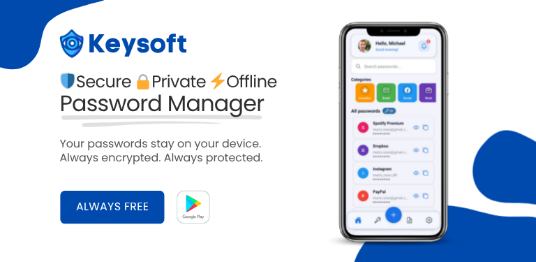

# Keysoft

[](https://github.com/TheStreamCode/keysoft/actions/workflows/ci.yml)
[](LICENSE)

Keysoft is an offline-first password manager for Android, with cloud-simulator compatibility for iPhone and iPad, built with Expo, React Native, and TypeScript. It stores vault data locally and protects user content with authenticated encryption.

The application is designed around a local-only operating model: the PIN/master password is never persisted, vault data is encrypted at rest, and the app does not require a backend service to operate.

Keysoft works offline for vault management. Network access is limited to platform services such as Expo/EAS updates and is not used to sync, upload, or transmit vault contents, PINs, master passwords, or encryption keys.

## Current Status

| Area                | Status                             |
| ------------------- | ---------------------------------- |
| Platform focus      | Android release; iOS cloud testing |
| App version         | 3.0.0                              |
| Android versionCode | 125 (EAS production)               |
| Expo SDK            | 57.0.8                             |
| React Native        | 0.86.0                             |
| TypeScript          | 6.0.3, strict mode                 |
| Test suite          | 28 suites, 176 tests               |
| Health check        | `expo-doctor` 20/20                |

Production build numbers are managed remotely by EAS. The local Android versionCode 123 in `app.config.js` is a manifest fallback and is ignored by EAS production builds; the Keysoft 3.0 release build targets remote versionCode 125.

## Core Capabilities

- Password vault with create, read, update, delete, search, pagination, and categories.
- Secure notes stored with the same vault encryption model.
- Local password generator backed by cryptographically secure randomness.
- Optional biometric unlock backed by SecureStore with device authentication.
- Local notifications for security reminders and backup prompts.
- Encrypted import/export workflow for user-managed backups.
- Italian and English localization with system-language detection.
- Automated i18n checks for Italian/English key parity, placeholder parity, and user-facing fallback regressions.
- Source-structure regression checks for lowercase directories and shared settings hook placement.
- Nocturne light/dark interface with responsive phone/tablet layouts, a dedicated PIN keypad, copy-first credential views, reduced-motion support, and accessible touch targets.
- Local vault-health analysis for weak, reused, and expired credentials.

## Design And Interaction

- Semantic theme tokens provide automatic light and dark appearances without screen-specific color branching.
- Responsive content bounds support compact phones, landscape, tablets, and split-view widths while preserving safe areas and 44-point minimum touch targets.
- Alerts and confirmations use the shared dialog primitive, selection workflows use bottom sheets, and non-blocking feedback uses in-app toasts.
- Entrance effects animate only opacity and transforms and respect the operating-system reduced-motion preference.
- The profile photo is previewed locally and persisted only when profile changes are saved; the same avatar and initial fallback are rendered on unlock, vault, and settings screens.
- The original Keysoft shield-and-eye artwork is the canonical launcher, adaptive, splash, favicon, and onboarding mark.

## Security Model

Keysoft uses the KS1 envelope for vault data:

- AES-256-CBC for encryption.
- HMAC-SHA256 for integrity verification.
- Argon2id in EAS/native builds when available, PBKDF2 fallback in Expo Go or where required.
- Expo Go is a development workflow. Vaults created in Expo Go use PBKDF2 fallback metadata; use EAS/native builds for release-grade Argon2 validation.
- 64-character hex derived keys.
- CSPRNG-backed salts, IVs, IDs, and password generation.
- The vault key stays in memory by default. If biometrics are enabled, the vault key is stored in SecureStore with device authentication required and is updated or removed when the PIN changes.
- PIN setup and PIN changes reuse the vault key derived during verifier creation to avoid duplicate KDF work while preserving the configured Argon2/PBKDF2 cost.

Backup files use a password-encrypted payload format (`KS1-PW1`) with KDF metadata and authenticated KS1 ciphertext.

See [Security Architecture](docs/security.md) for the full model, operational assumptions, and storage rules.

## Documentation

- [Architecture](docs/architecture.md)
- [Security Architecture](docs/security.md)
- [Development Guide](docs/development.md)
- [Release Guide](docs/release.md)
- [iOS Testing Without Apple Hardware](docs/ios-testing.md)
- [Public Repository Checklist](docs/publication.md)
- [First-Party Copyright And Scope Record](COPYRIGHT.md)
- [Pre-Build Security/UI Review](docs/pre-build-security-ui-review.md)
- [Keysoft 3.0 Release Notes](docs/releases/3.0.0.md)
- [Changelog](CHANGELOG.md)

## Requirements

- Bun
- Node.js compatible with the Expo toolchain
- Expo Go installed on the Android device used for development
- Expo account access for EAS builds on expo.dev
- Expo CLI via `bunx expo`

## Installation

```bash
bun install
```

## Development

Start the Expo development server for Expo Go:

```bash
bun run start
```

Open on Android with Expo Go:

```bash
bun run android
```

Use a tunnel when the phone cannot reach the local machine over LAN:

```bash
bun run start:tunnel
```

Run web for development/testing:

```bash
bun run web
```

Build artifacts are produced on expo.dev through EAS:

```bash
bun run build:android:preview
bun run build:android:production
bun run build:ios:simulator
```

EAS builds upload the project to expo.dev. Start them only after the release checklist is complete and the upload has been explicitly approved.

### Build from GitHub

The repository is linked to EAS Build. The Android production workflow runs for version tags or manual dispatch. iOS is retained as a cloud-simulator test target; App Store publication is intentionally outside the project release workflow.

## Verification

Run the full local verification suite before shipping changes:

```bash
bun run typecheck
bun run lint
bun run test
bunx expo-doctor
bunx expo export --platform android --output-dir C:\tmp\keysoft-android-export
```

Current verified state:

- `bun run typecheck`: passing
- `bun run lint`: passing
- `bun run test`: passing, 28 suites and 176 tests
- `bunx expo-doctor`: passing, 20/20 checks
- `bunx expo export --platform android --output-dir C:\tmp\keysoft-android-export`: passing
- `bunx expo export --platform ios --output-dir C:\tmp\keysoft-ios-export`: passing

## Project Structure

```text
src/
  components/        Shared UI components
    brand/            Canonical in-app brand mark
    ui/               Dialog, bottom sheet, toast, motion, PIN keypad, and controls
  contexts/          Application state providers
  hooks/             Complex screen and behavior logic
    settings/        Settings workflows extracted from SettingsScreen
                     (usePinManagement, useNotificationSettings,
                      useProfileForm, useExportImport)
  locales/           i18n dictionaries (it.ts, en.ts) consumed by LanguageContext
  models/            TypeScript domain models
  navigation/        Navigation configuration (typed via NativeStackScreenProps)
  screens/           User-facing screens
  services/          Business, crypto, storage, auth, and utility services
  utils/             Shared platform and security helpers (incl. withTimeout)
```

Path aliases (`@/*`, `@components/*`, `@services/*`, …) are configured in
`tsconfig.json` and `babel.config.js` for use in new code.

## Data Ownership

Keysoft is local-first. The user owns their vault data and is responsible for keeping backup files and the master password secure. The app cannot recover a lost master password because no server-side recovery material exists.

## Support

Product assistance is available through the shared Mikesoft support page: [mikesoft.it/en/support](https://mikesoft.it/en/support/). Do not include passwords, PINs, encryption keys, or real vault data in support requests.

If Keysoft's local-first security work is useful to you, support continued development through GitHub Sponsors: [github.com/sponsors/TheStreamCode](https://github.com/sponsors/TheStreamCode).

The current public privacy notice is available in [English](https://mikesoft.it/en/keysoft-policy/) and [Italian](https://mikesoft.it/it/keysoft-policy/). It documents Android distribution, iOS cloud-simulator testing, local storage, Expo Updates traffic, permissions, and user-controlled backups.

## License

This project is licensed under the [Apache License 2.0](LICENSE) (`Apache-2.0`). See the [first-party copyright and scope record](COPYRIGHT.md), [third-party notices](THIRD_PARTY_NOTICES.md), and [TRADEMARKS.md](TRADEMARKS.md).

## Responsible Disclosure

Please do not open public issues for vulnerabilities. Follow [SECURITY.md](SECURITY.md) for private reporting guidance.
