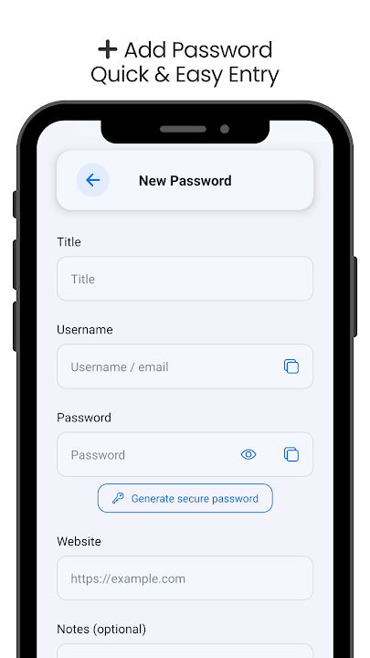
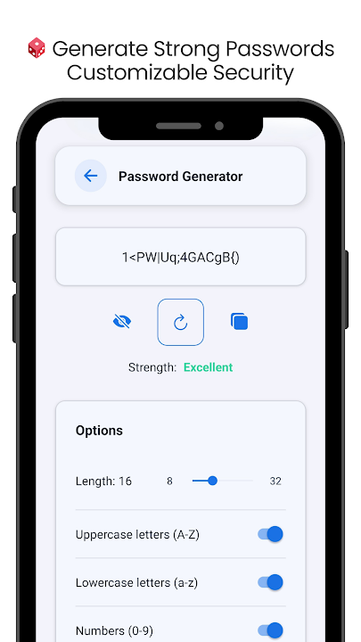
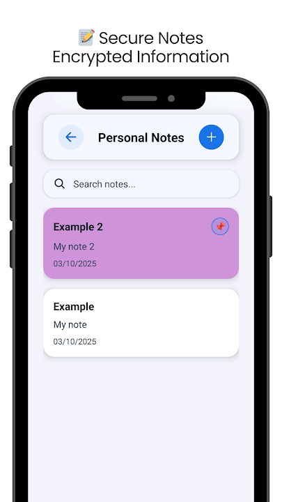
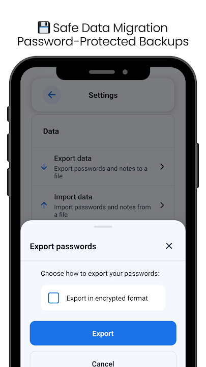

<a href="https://play.google.com/store/apps/details?id=it.mikesoft.keysoft">
  
</a>

# Keysoft

<p align="center">
  <strong>A private, offline-first password manager for Android.</strong><br />
  No account, no ads, no cloud vault, and no tracking SDKs.
</p>

<p align="center">
  <a href="https://github.com/TheStreamCode/keysoft/actions/workflows/ci.yml"></a>
  <a href="https://github.com/TheStreamCode/keysoft/releases/latest"></a>
  <a href="LICENSE"></a>
</p>

<p align="center">
  <a href="https://play.google.com/store/apps/details?id=it.mikesoft.keysoft">
    
  </a>
</p>

<p align="center">
  <a href="https://play.google.com/store/apps/details?id=it.mikesoft.keysoft">Google Play</a> ·
  <a href="https://mikesoft.it/en/keysoft-policy/">Privacy</a> ·
  <a href="SECURITY.md">Security</a> ·
  <a href="https://github.com/TheStreamCode/keysoft/releases/latest">Latest release</a>
</p>

Keysoft keeps passwords and secure notes encrypted on the device and works without a
backend service. Network access is limited to platform services such as Expo/EAS update
delivery; vault contents, PINs, master passwords, and encryption keys are never used for
sync or remote storage.

## Why Keysoft

- **Private by default:** no registration, cloud vault, advertising, or analytics SDK.
- **Useful offline:** create, search, organize, and copy credentials without connectivity.
- **Encrypted locally:** authenticated vault encryption with tamper detection.
- **Fast unlock:** optional biometric access backed by device-authenticated SecureStore.
- **User-owned backups:** password-protected import/export without a remote backup account.
- **Practical security tools:** secure notes, password generation, vault-health checks,
  clipboard auto-clear, local reminders, and optional screenshot protection.
- **Accessible and responsive:** Italian and English UI, light/dark themes, reduced-motion
  support, and phone/tablet layouts.

## Product Tour

The screenshots below are taken from the production Android listing on Google Play.

<table>
  <tr>
    <td align="center"></td>
    <td align="center"></td>
    <td align="center"></td>
    <td align="center"></td>
  </tr>
  <tr>
    <td align="center"><strong>Quick entry</strong></td>
    <td align="center"><strong>Password generator</strong></td>
    <td align="center"><strong>Secure notes</strong></td>
    <td align="center"><strong>Encrypted backups</strong></td>
  </tr>
</table>

## Security Model

Keysoft uses the versioned KS1 envelope for vault data:

- AES-256-CBC encryption with HMAC-SHA256 integrity verification.
- Argon2id key derivation in native builds; Expo Go uses the documented PBKDF2
  development fallback.
- CSPRNG-backed salts, IVs, identifiers, and password generation.
- A 64-character derived vault key held in memory by default.
- Optional biometric unlock stores only the derived vault key in SecureStore with device
  authentication required.
- Encrypted backups use the versioned `KS1-PW1` format and a user-provided passphrase.

Keysoft cannot recover a forgotten master PIN because it has no server-side recovery
material. Read the [security architecture](docs/security.md) for the full model, accepted
trade-offs, and migration rules. Vulnerabilities should be reported privately through the
[security policy](SECURITY.md), never through a public issue.

## Current Release

Keysoft 3.3.1 is the current source release and Android production-build target.
[Google Play](https://play.google.com/store/apps/details?id=it.mikesoft.keysoft) currently
distributes Keysoft 3.3.0 (build 129) until the separately reviewed 3.3.1 app bundle is
submitted. Android is the production platform. iPhone and iPad remain cloud-simulator
compatibility targets and are not currently distributed through the App Store.

The source of truth for shipped changes is the [changelog](CHANGELOG.md) and the
[latest GitHub release](https://github.com/TheStreamCode/keysoft/releases/latest). Exact
verification results are recorded in dated release and audit documents instead of being
duplicated here.

## Developer Quick Start

Requirements:

- Bun 1.3.14.
- Node.js 22.13 or newer.
- Expo Go on an Android device for day-to-day development.

Install and start:

```bash
bun install
bun run start
```

Useful commands:

```bash
bun run android
bun run start:tunnel
bun run web
bun run verify
bun run deps:audit
```

Use `bun install --frozen-lockfile` for clean validation. Keysoft requires no local
environment variables or backend service. Never place credentials in `EXPO_PUBLIC_*`
variables: Expo embeds them in the client bundle.

Release artifacts are produced through EAS. EAS build, submission, tag, and release
operations must only be started through the documented, explicitly approved release
workflow. See the [development guide](docs/development.md) and
[release guide](docs/release.md).

## Project Structure

```text
src/
  components/        Shared UI and interaction primitives
  contexts/          Authentication, language, theme, and alert state
  hooks/             Complex screen and settings workflows
  locales/           Italian and English dictionaries
  models/            TypeScript domain models
  navigation/        Typed application navigation
  screens/           User-facing application screens
  services/          Auth, crypto, storage, import/export, and utilities
  utils/             Shared platform and security helpers
```

## Documentation

- [Architecture](docs/architecture.md)
- [Security Architecture](docs/security.md)
- [Security and Code Audit (2026-08-08)](docs/security-audit-2026-08-08.md)
- [Development Guide](docs/development.md)
- [Release Guide](docs/release.md)
- [iOS Testing Without Apple Hardware](docs/ios-testing.md)
- [Public Repository Checklist](docs/publication.md)
- [Keysoft 3.3.1 Release Notes](docs/releases/3.3.1.md)
- [Changelog](CHANGELOG.md)

## Contributing

Contributions are welcome through focused pull requests. Read
[CONTRIBUTING.md](CONTRIBUTING.md), keep security-sensitive changes small and testable,
and run `bun run verify` before requesting review.

## Data Ownership and Support

Users own their local vault data and are responsible for retaining backup files and the
master passphrase. Product assistance is available at
[keysoft@mikesoft.it](mailto:keysoft@mikesoft.it); never include real vault contents,
PINs, encryption keys, or backup payloads in support requests.

Keysoft development can be supported through
[GitHub Sponsors](https://github.com/sponsors/TheStreamCode).

## License and Attribution

Keysoft is licensed under the [Apache License 2.0](LICENSE). See
[COPYRIGHT.md](COPYRIGHT.md), [THIRD_PARTY_NOTICES.md](THIRD_PARTY_NOTICES.md), and
[TRADEMARKS.md](TRADEMARKS.md) for first-party scope, dependency notices, and trademark
terms.
